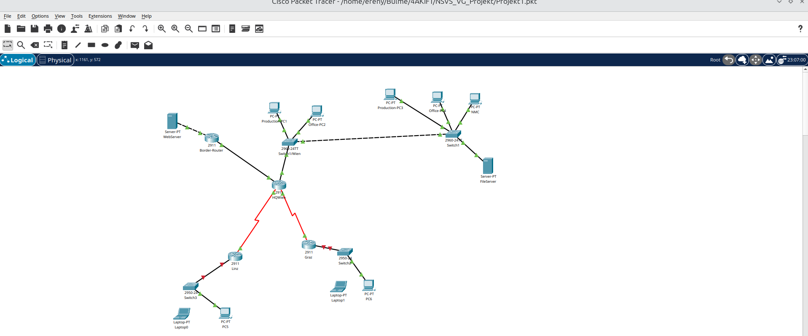
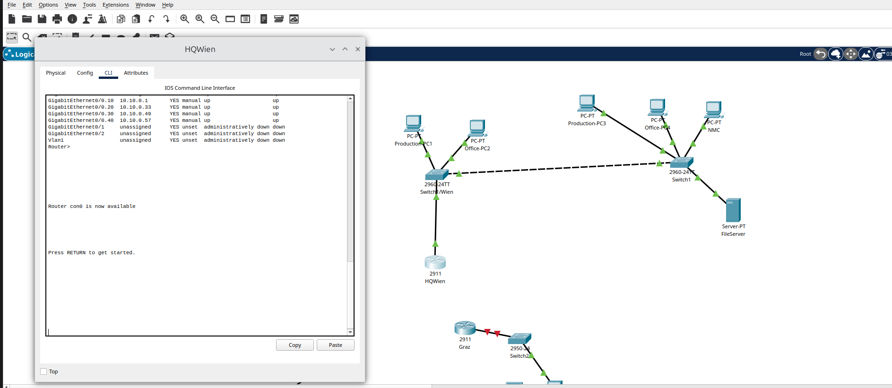
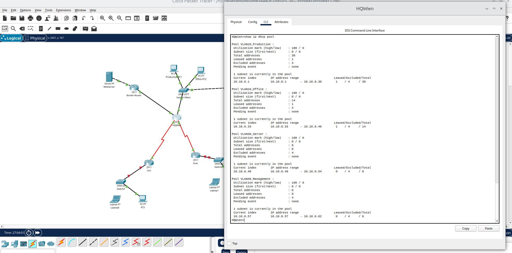
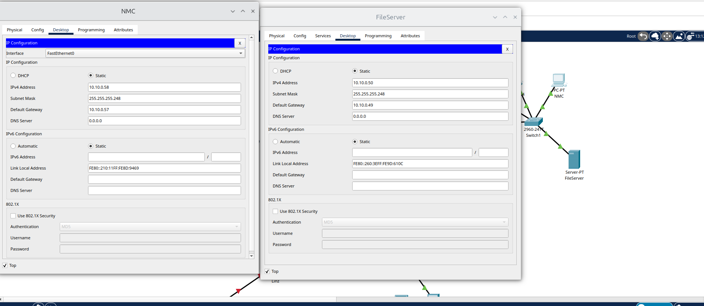
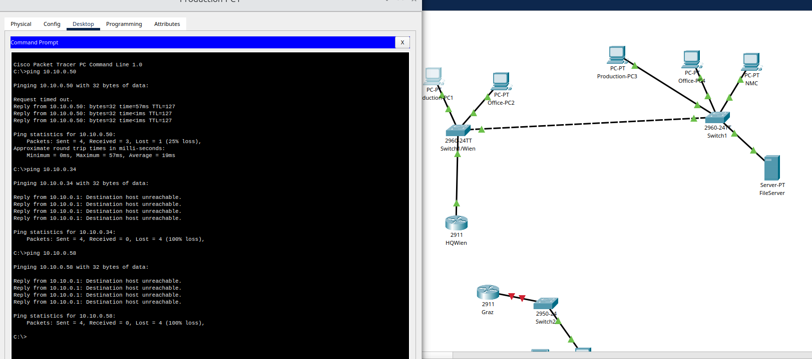
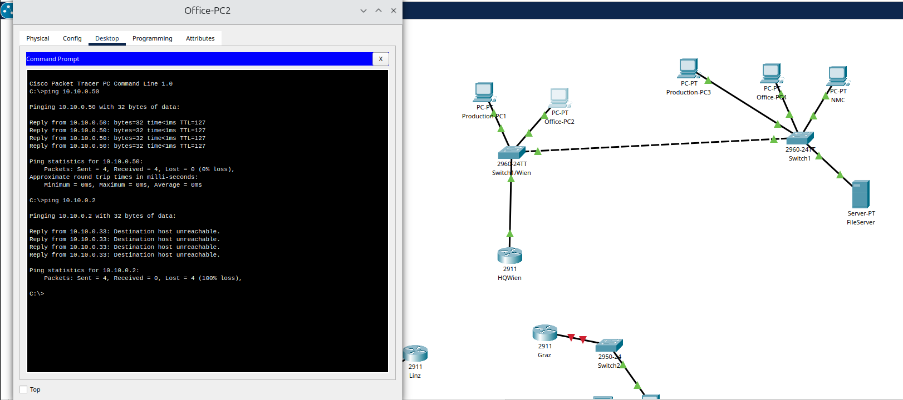
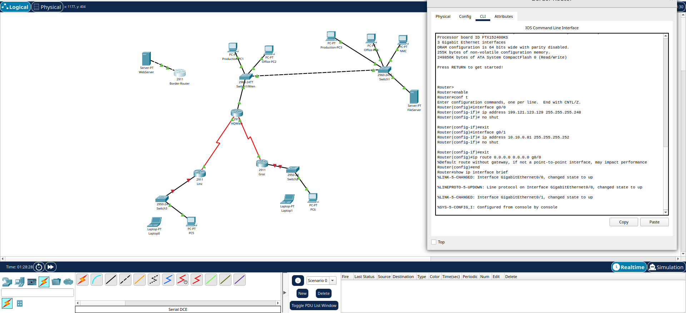
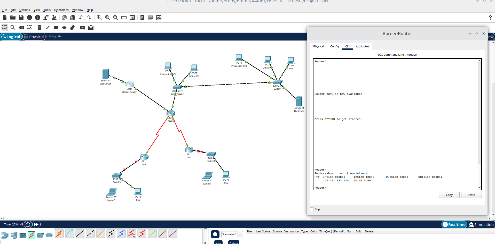

# DOKUMENTATION – NSVS Projekt 1 (Schritt für Schritt)

> Diese Datei ist deine **Arbeits- und Abgabedoku**:  
> Wir gehen sie gemeinsam durch und haken jede Phase ab.

---

## Projektdaten

- **Projekt:** NSVS Projekt 1 – Firmennetzwerk
- **Klasse/Gruppe:** 4AKIFT
- **Bearbeiter:** Micail Ereny
- **Datum:** 13.06.2026
- **Packet Tracer Datei:** `Projekt1.pkt`

---

## Netzwerk-Topologie



**Übersicht der Standorte:**

| Standort | Geräte | Verbindungstyp |
|---|---|---|
| **Wien (HQ)** | HQWien Router, SW-Wien-Links, Switch1, 4x PC, NMC, FileServer | LAN (Ethernet) |
| **Border** | Border-Router, Web-Server | Ethernet → ISP |
| **Linz** | Branch-Linz Router, Switch3, PC5, Laptop1 (WLAN) | Leased Line → Wien |
| **Graz** | Branch-Graz Router, Switch2, PC6, Laptop0 (WLAN) | Leased Line → Wien |

---

## Netzwerkeinteilung – Gesamtübersicht aller Subnetze

| Subnetz / Standort | Präfix | Netzadresse | Subnetzmaske | Gateway | Nutzbare Hosts | Broadcast | VLAN |
|---|---|---|---|---|---|---|---|
| Wien – Produktion | /27 (30 Hosts) | `10.10.0.0/27` | 255.255.255.224 | `10.10.0.1` | 10.10.0.1 – 10.10.0.30 | 10.10.0.31 | VLAN 10 |
| Wien – Verwaltung | /28 (14 Hosts) | `10.10.0.32/28` | 255.255.255.240 | `10.10.0.33` | 10.10.0.33 – 10.10.0.46 | 10.10.0.47 | VLAN 20 |
| Wien – Server | /29 (6 Hosts) | `10.10.0.48/29` | 255.255.255.248 | `10.10.0.49` | 10.10.0.49 – 10.10.0.54 | 10.10.0.55 | VLAN 30 |
| Wien – Management | /29 (6 Hosts) | `10.10.0.56/29` | 255.255.255.248 | `10.10.0.57` | 10.10.0.57 – 10.10.0.62 | 10.10.0.63 | VLAN 40 |
| Linz LAN | /29 (6 Hosts) | `10.10.0.64/29` | 255.255.255.248 | `10.10.0.65` | 10.10.0.65 – 10.10.0.70 | 10.10.0.71 | VLAN 50 |
| WAN Wien–Linz | /30 (2 Hosts) | `10.10.0.72/30` | 255.255.255.252 | `10.10.0.73` | 10.10.0.73 – 10.10.0.74 | 10.10.0.75 | — |
| WAN Wien–Graz | /30 (2 Hosts) | `10.10.0.76/30` | 255.255.255.252 | `10.10.0.77` | 10.10.0.77 – 10.10.0.78 | 10.10.0.79 | — |
| WAN Border–HQWien | /30 (2 Hosts) | `10.10.0.80/30` | 255.255.255.252 | `10.10.0.81` | 10.10.0.81 – 10.10.0.82 | 10.10.0.83 | — |
| Graz LAN | /26 (62 Hosts) | `10.10.0.128/26` | 255.255.255.192 | `10.10.0.129` | 10.10.0.129 – 10.10.0.190 | 10.10.0.191 | VLAN 60 |
| Öffentlich (ISP) | /29 (6 Hosts) | `199.121.123.128/29` | 255.255.255.248 | `199.121.123.129` | 199.121.123.129 – .134 | 199.121.123.135 | — |

### Statische Geräte-IPs

| Gerät | Standort | Interface | IP-Adresse | Zweck |
|---|---|---|---|---|
| HQ-Router | Wien | G0/0.30 | `10.10.0.49` | Gateway für File-Server |
| File-Server | Wien | NIC | `10.10.0.50` | Interner Datenspeicher |
| NMC-PC | Wien | NIC | `10.10.0.58` | Netzwerk-Management |
| Border Router | Wien | G0/1 (outside) | `199.121.123.129` | Anbindung an ISP |
| Web-Server | Internet | NIC | `199.121.123.130` | Öffentlicher Test-Server |

---

## VLSM-Planung (mit ~20% Puffer)

| Abteilung / Standort | Hosts (real) | Mit Puffer (~20%) | Benötigte Größe | Präfix |
|---|---:|---:|---:|---|
| Graz | 40 | 48 | 64 Adressen | `/26` (62 Hosts) |
| Wien – Produktion | 22 | 27 | 32 Adressen | `/27` (30 Hosts) |
| Wien – Verwaltung | 7 | 9 | 16 Adressen | `/28` (14 Hosts) |
| Linz | 4 | 5 | 8 Adressen | `/29` (6 Hosts) |
| Wien – Server | 2–3 | 4 | 8 Adressen | `/29` (6 Hosts) |
| Wien – Management | 2–3 | 4 | 8 Adressen | `/29` (6 Hosts) |
| WAN Wien–Linz | 2 | 2 | 4 Adressen | `/30` (2 Hosts) |
| WAN Wien–Graz | 2 | 2 | 4 Adressen | `/30` (2 Hosts) |
| WAN Border–HQWien | 2 | 2 | 4 Adressen | `/30` (2 Hosts) |
| Öffentlich (ISP) | 3 | 4 | 8 Adressen | `/29` (6 Hosts) |

---

## Öffentliche IP-Adressen (ISP) – `199.121.123.128/29`

| Verwendung | IP-Adresse |
|---|---|
| Netzadresse | `199.121.123.128` |
| Border Router (outside) | `199.121.123.129` |
| Web-Server (öffentlich, fix) | `199.121.123.130` |
| NAT-Pool Reserve | `199.121.123.131 – 199.121.123.134` |
| Broadcast | `199.121.123.135` |

---

## VLAN-Schema

| VLAN-ID | Name | Subnetz | Standort |
|---|---|---|---|
| VLAN 10 | Produktion | `10.10.0.0/27` | Wien |
| VLAN 20 | Verwaltung | `10.10.0.32/28` | Wien |
| VLAN 30 | Server | `10.10.0.48/29` | Wien |
| VLAN 40 | Management | `10.10.0.56/29` | Wien |
| VLAN 50 | Linz_LAN | `10.10.0.64/29` | Linz |
| VLAN 60 | Graz_LAN | `10.10.0.128/26` | Graz |

### Switch Wien-Links – Port-Belegung

| Port | Gerät | VLAN | Port-Typ |
|---|---|---|---|
| Fa0/1 | Production-PC1 | VLAN 10 | Access |
| Fa0/2 | Production-PC3 | VLAN 10 | Access |
| Fa0/3 | Office-PC2 | VLAN 20 | Access |
| Fa0/4 | Office-PC4 | VLAN 20 | Access |
| Fa0/24 | → Switch1 (Rechts) | Trunk | Trunk |
| Gi0/1 | → HQ Wien Router | Trunk | Trunk |

### Switch1 (Wien-Rechts) – Port-Belegung

| Port | Gerät | VLAN | Port-Typ |
|---|---|---|---|
| Fa0/1 | Production-PC3 | VLAN 10 | Access |
| Fa0/2 | NMC (Management PC) | VLAN 40 | Access |
| Fa0/3 | Office-PC4 | VLAN 20 | Access |
| Fa0/4 | File-Server | VLAN 30 | Access |
| Fa0/24 | → Switch Wien-Links | Trunk | Trunk |

### Switch Linz + Switch Graz – Port-Belegung

| Port | Gerät | Port-Typ |
|---|---|---|
| Fa0/1 | PC5 / PC6 | Access |
| Fa0/2 | Laptop (WLAN-AP) | Access |
| Gi0/1 | → Branch Router | Access |

---

## Verwendete Geräte

### Netzwerkgeräte

| Gerätetyp | Modell | Name | Funktion |
|---|---|---|---|
| Router | Cisco 2911 | Border-Router | Internet-Anbindung, NAT/PAT |
| Router | Cisco 2911 + HWIC-2T | HQ Wien | Hauptrouter, Inter-VLAN, WAN |
| Router | Cisco 2911 + HWIC-1T | Branch Linz | Router Niederlassung Linz |
| Router | Cisco 2911 + HWIC-1T | Branch Graz | Router Niederlassung Graz |
| Switch | Catalyst 2960-24TT | SW-Wien-Links | Access-Switch Produktion/Verwaltung |
| Switch | Catalyst 2960-24TT | Switch1 | Access-Switch Server/Management |
| Switch | Catalyst 2960-24TT | Switch2 (Graz) | Access-Switch Graz |
| Switch | Catalyst 2960-24TT | Switch3 (Linz) | Access-Switch Linz |
| Access Point | AP-PT | Access Point0 | WLAN Linz (`Linz-WLAN`) |
| Access Point | AP-PT | Access Point1 | WLAN Graz (`Graz-WLAN`) |

### Endgeräte

| Gerätetyp | Name | Bereich | IP-Bezug |
|---|---|---|---|
| PC | Production-PC1 | VLAN 10 – Wien Produktion | DHCP |
| PC | Production-PC3 | VLAN 10 – Wien Produktion | DHCP |
| PC | Office-PC2 | VLAN 20 – Wien Verwaltung | DHCP |
| PC | Office-PC4 | VLAN 20 – Wien Verwaltung | DHCP |
| PC | NMC | VLAN 40 – Management | `10.10.0.58` (fix) |
| Server | File-Server | VLAN 30 – Wien Server | `10.10.0.50` (fix) |
| Server | Web-Server | Öffentlich | `199.121.123.130` (fix) |
| PC | PC5 | Linz LAN | DHCP |
| PC | PC6 | Graz LAN | DHCP |
| Laptop | Laptop0 | Graz LAN (WLAN) | DHCP |
| Laptop | Laptop1 | Linz LAN (WLAN) | DHCP |

---

## Kabeltypen

| Verbindung | Kabeltyp |
|---|---|
| PC / Server → Switch | Copper Straight-Through |
| Switch → Router | Copper Straight-Through |
| Switch ↔ Switch | Copper Cross-Over |
| Border Router → Web-Server | Copper Straight-Through |
| Border Router → HQ Wien | Copper Straight-Through |
| HQ Wien ↔ Branch Linz | Serial DCE/DTE |
| HQ Wien ↔ Branch Graz | Serial DCE/DTE |
| AP → Switch | Copper Straight-Through |

> `clock rate 64000` wird **nur** am DCE-Ende (HQ Wien) gesetzt.

---

## Sicherheitskonzept

| Maßnahme | Wo | Beschreibung |
|---|---|---|
| ACL 101 | HQ Wien Gi0/0.10 (inbound) | Production darf nur Server + eigenes VLAN; Office + Management blockiert |
| ACL 102 | HQ Wien Gi0/0.20 (inbound) | Office darf nur Server + eigenes VLAN; Production + Management blockiert |
| ACL 103 | HQ Wien Gi0/0.40 (inbound) | Management (NMC) darf alles |
| NAT/PAT | Border Router | Alle internen PCs → eine öffentliche IP (`overload`) |
| Statisches NAT | Border Router | File-Server fix auf `199.121.123.130` |
| Port-Security | SW-Wien-Links + Switch1 | Max. 1 MAC pro Port, `violation restrict`, `sticky` |
| SSH v2 | HQ Wien | NMC-Fernzugriff mit `admin` / `cisco123`, domain `frb.local` |
| VLAN-Trennung | Alle Switches | Abteilungen logisch isoliert |

---

## Fortschritt (Live)

- [x] Phase 1 – Ausgangsstand prüfen
- [x] Phase 2 – Router (Subinterfaces + DHCP)
- [x] Phase 3 – Switch Wien-Links
- [x] Phase 4 – Switch1 (Wien-Rechts)
- [x] Phase 5 – Endgeräte konfigurieren
- [x] Phase 6 – ACLs konfigurieren
- [x] Phase 7 – Tests + Validierung
- [x] Phase 8 – Leased Lines Wien ↔ Linz/Graz + Statisches Routing
- [x] Phase 9 – Border Router konfigurieren
- [x] Phase 10 – NAT/PAT + statisches NAT (Web-Server)
- [x] Phase 11 – SSH Remote Management (NMC)
- [x] Phase 12 – Port-Security (LAN-Security)
- [x] Abschluss + Abgabe

---

## Screenshot-Ablage

Lege alle Bilder in den Ordner `screenshots/`.

| ID | Screenshot | Tatsächlicher Dateiname |
|---|---|---|
| SS-01 | Topologie | `SS-01_Topologie.png` ✅ |
| SS-02 | `show ip interface brief` | `SS-02_Router_show_ip_interface_brief_2026-05-20.png` ✅ |
| SS-03 | `show ip dhcp pool` | `SS-03_DHCP_Pool.png` ✅ |
| SS-04 | Switch Wien-Links (VLAN + Trunk) | `SS-02_Switch_show_vlan_brief_show_interfaces_trunk_2026-05-20.png` ✅ |
| SS-05 | Switch1 (VLAN + Trunk) | `SS-02_Switch_show_vlan_brief_show_interfaces_trunk_sw2_2026-05-20.png` ✅ |
| SS-06 | NMC + FileServer IP Config | `NMC_PC_FileServerCONFIG.png` ✅ |
| SS-07 | FileServer Services | `Bildschirmfoto vom 2026-06-13 21-03-54.png` ✅ |
| SS-08 | ACL Nachweis | `Bildschirmfoto vom 2026-06-13 21-08-24.png` ✅ |
| SS-09 | Erlaubter Ping (Production-PC1) | `ping_nachweis.png` ✅ |
| SS-10 | Blockierter Ping (Office-PC2) | `ping_nachweis2.png` ✅ |
| SS-11 | Leased Lines `show ip interface brief` (HQ Wien) | `Bildschirmfoto vom 2026-06-13 22-51-11.png` ✅ |
| SS-12 | Routing-Tabelle `show ip route` (HQ Wien) | `Bildschirmfoto vom 2026-06-13 23-42-22.png` ✅ |
| SS-13 | NAT/PAT `show ip nat translations` | `SS-13_NAT_Translations.png` ✅ |
| SS-14 | Web-Server öffentliche IP + HTTP-Test | `SS-14_WebServer_HTTP_Test.png` ✅ |
| SS-15 | SSH-Login vom NMC auf HQ Wien | `Bildschirmfoto vom 2026-06-13 23-49-37.png` ✅ |
| SS-16 | Port-Security beide Switches | `Bildschirmfoto vom 2026-06-14 00-02-50.png` ✅ |

---

## Phase 1 – Ausgangsstand prüfen

### Ziel
Topologie, Geräte und Basis-Verbindungen verifizieren.

### Anleitung (Packet Tracer)
1. `Projekt1.pkt` öffnen.
2. Im **Logical**-Tab Geräte prüfen.
3. Im **Physical**-Tab Kabel prüfen.
4. Router CLI öffnen und Status kontrollieren.

### Befehle
```bash
show ip interface brief
```

### Soll-Ergebnis
- Router-Interface `Gi0/0` sichtbar und aktiv.
- Topologie vollständig.

### Screenshot


### Abhaken
- [x] Phase 1 fertig ✅ (13.06.2026 – Topologie + Gi0/0 up/up bestätigt)

---

## Phase 2 – Router konfigurieren (Router-on-a-Stick + DHCP)

### Ziel
Subinterfaces für VLAN 10/20/30/40 und DHCP-Pools konfigurieren.

### Befehle
```bash
enable
configure terminal
interface gi 0/0
 no shutdown
exit
interface gi 0/0.10
 encapsulation dot1Q 10
 ip address 10.10.0.1 255.255.255.224
 no shutdown
exit
interface gi 0/0.20
 encapsulation dot1Q 20
 ip address 10.10.0.33 255.255.255.240
 no shutdown
exit
interface gi 0/0.30
 encapsulation dot1Q 30
 ip address 10.10.0.49 255.255.255.248
 no shutdown
exit
interface gi 0/0.40
 encapsulation dot1Q 40
 ip address 10.10.0.57 255.255.255.248
 no shutdown
exit

ip dhcp excluded-address 10.10.0.1
ip dhcp excluded-address 10.10.0.33
ip dhcp excluded-address 10.10.0.49
ip dhcp excluded-address 10.10.0.57

ip dhcp pool VLAN10_Production
 network 10.10.0.0 255.255.255.224
 default-router 10.10.0.1
exit
ip dhcp pool VLAN20_Office
 network 10.10.0.32 255.255.255.240
 default-router 10.10.0.33
exit
ip dhcp pool VLAN30_Server
 network 10.10.0.48 255.255.255.248
 default-router 10.10.0.49
exit
ip dhcp pool VLAN40_Management
 network 10.10.0.56 255.255.255.248
 default-router 10.10.0.57
exit
end
show ip interface brief
show ip dhcp pool
```

### Screenshot



### Abhaken
- [x] Phase 2 fertig ✅ (13.06.2026 – Gi0/0.10/.20/.30/.40 alle up/up, 4 DHCP-Pools angelegt)

---

## Phase 3 – Switch Wien-Links konfigurieren

### Ziel
VLANs erstellen, Access-Ports setzen, Trunks aktivieren.

### Befehle
```bash
enable
configure terminal
vlan 10
 name Production
exit
vlan 20
 name Office
exit
vlan 30
 name Server
exit
vlan 40
 name Management
exit
interface fa0/1
 switchport mode access
 switchport access vlan 10
 no shutdown
exit
interface fa0/3
 switchport mode access
 switchport access vlan 20
 no shutdown
exit
interface fa0/24
 switchport mode trunk
 switchport trunk allowed vlan 10,20,30,40
 no shutdown
exit
interface gi0/1
 switchport mode trunk
 switchport trunk allowed vlan 10,20,30,40
 no shutdown
end
show vlan brief
show interfaces trunk
```

### Screenshot


### Abhaken
- [x] Phase 3 fertig ✅ (13.06.2026 – VLAN 10/20/30/40 aktiv, Fa0/1→VLAN10, Fa0/3→VLAN20, Fa0/24+Gi0/1 trunking)

---

## Phase 4 – Switch1 (Wien-Rechts) konfigurieren

### Ziel
VLANs, Access-Ports für Produktion/Office/Server/Management und Trunk setzen.

### Befehle
```bash
enable
configure terminal
vlan 10
 name Production
exit
vlan 20
 name Office
exit
vlan 30
 name Server
exit
vlan 40
 name Management
exit
interface fa0/1
 switchport mode access
 switchport access vlan 10
 no shutdown
exit
interface fa0/2
 switchport mode access
 switchport access vlan 40
 no shutdown
exit
interface fa0/3
 switchport mode access
 switchport access vlan 20
 no shutdown
exit
interface fa0/4
 switchport mode access
 switchport access vlan 30
 no shutdown
exit
interface fa0/24
 switchport mode trunk
 switchport trunk allowed vlan 10,20,30,40
 no shutdown
end
show vlan brief
show interfaces trunk
```

### Screenshot


### Abhaken
- [x] Phase 4 fertig ✅ (13.06.2026 – VLAN 10/20/30/40 aktiv, Fa0/1→10, Fa0/2→40, Fa0/3→20, Fa0/4→30, Fa0/24 trunking)

---

## Phase 5 – Endgeräte konfigurieren

### Ziel
DHCP für Clients, statische IP für NMC und FileServer.

### Anleitung
- Production-PCs + Office-PCs: Desktop → IP Configuration → **DHCP**.
- NMC: **Static** `10.10.0.58 / 255.255.255.248`, GW `10.10.0.57`.
- FileServer: **Static** `10.10.0.50 / 255.255.255.248`, GW `10.10.0.49`.
- FileServer Services: FTP/HTTP/SMTP auf **On**.

### Screenshot



### Abhaken
- [x] Phase 5 fertig ✅ (13.06.2026 – NMC 10.10.0.58/29 Static ✅, FileServer 10.10.0.50/29 Static ✅, FTP/HTTP/SMTP ON ✅)

---

## Phase 6 – ACLs konfigurieren

### Ziel
Kommunikation absichern:
- Produktion/Verwaltung dürfen zum Server.
- Produktion ↔ Verwaltung blockiert.
- Management darf alles.

### Befehle
```bash
configure terminal
access-list 101 remark Production VLAN10
access-list 101 permit icmp 10.10.0.0 0.0.0.31 10.10.0.48 0.0.0.7
access-list 101 permit icmp 10.10.0.0 0.0.0.31 10.10.0.0 0.0.0.31
access-list 101 deny icmp 10.10.0.0 0.0.0.31 10.10.0.32 0.0.0.15
access-list 101 deny icmp 10.10.0.0 0.0.0.31 10.10.0.56 0.0.0.7
access-list 101 permit ip any any

access-list 102 remark Office VLAN20
access-list 102 permit icmp 10.10.0.32 0.0.0.15 10.10.0.48 0.0.0.7
access-list 102 permit icmp 10.10.0.32 0.0.0.15 10.10.0.32 0.0.0.15
access-list 102 deny icmp 10.10.0.32 0.0.0.15 10.10.0.0 0.0.0.31
access-list 102 deny icmp 10.10.0.32 0.0.0.15 10.10.0.56 0.0.0.7
access-list 102 permit ip any any

access-list 103 remark Management VLAN40
access-list 103 permit icmp 10.10.0.56 0.0.0.7 any
access-list 103 permit ip any any

interface gi0/0.10
 ip access-group 101 in
exit
interface gi0/0.20
 ip access-group 102 in
exit
interface gi0/0.40
 ip access-group 103 in
end
show access-lists
show ip interface gi0/0.10
```

### Screenshot


### Abhaken
- [x] Phase 6 fertig ✅ (13.06.2026 – ACL 101/102/103 vorhanden, Interface-Binding bestätigt: Gi0/0.10→101, Gi0/0.20→102, Gi0/0.40→103)

---

## Phase 7 – Tests und Validierung

### Ziel
Erlaubte und blockierte Kommunikation verifizieren.

### Test-Befehle
```bash
# Production-PC1
ping 10.10.0.50
ping 10.10.0.34
ping 10.10.0.58

# Office-PC2
ping 10.10.0.50
ping 10.10.0.2

# NMC
ping 10.10.0.2
```

### Soll-Ergebnis
- Erlaubte Pings erfolgreich.
- Blockierte Pings mit Timeout.

### Kommunikationsmatrix (Soll-Zustand)

| Von ↓ / Nach → | Production `10.10.0.0/27` | Office `10.10.0.32/28` | Server `10.10.0.48/29` | Management `10.10.0.56/29` | Linz `10.10.0.64/29` | Graz `10.10.0.128/26` |
|---|:---:|:---:|:---:|:---:|:---:|:---:|
| **Production** (VLAN10) | ✅ | ❌ | ✅ | ❌ | ✅ | ✅ |
| **Office** (VLAN20) | ❌ | ✅ | ✅ | ❌ | ✅ | ✅ |
| **Server** (VLAN30) | ✅ | ✅ | ✅ | ✅ | ✅ | ✅ |
| **Management/NMC** (VLAN40) | ✅ | ✅ | ✅ | ✅ | ✅ | ✅ |
| **Linz** (Branch) | ✅ | ✅ | ✅ | ✅ | ✅ | ✅ |
| **Graz** (Branch) | ✅ | ✅ | ✅ | ✅ | ✅ | ✅ |

> ✅ = Kommunikation erlaubt | ❌ = durch ACL blockiert

### Screenshot



### Abhaken
- [x] Phase 7 fertig ✅ (13.06.2026)
  - Production-PC1 → FileServer (10.10.0.50): **Reply** ✅
  - Production-PC1 → Office (10.10.0.34): **blockiert** ✅
  - Office-PC2 → FileServer (10.10.0.50): **Reply** ✅
  - Office-PC2 → Production (10.10.0.2): **blockiert** ✅
  - NMC → Production (10.10.0.2): **Reply** ✅

---

## Notizen / Probleme / Lösungen (live mitführen)

| Phase | Problem | Ursache | Lösung |
|---|---|---|---|
| 7 | NMC → Production Ping Timeout | ACL 101 blockierte Echo-Reply-Pakete auf Gi0/0.10 | `echo-reply` Permit-Regel vor deny in ACL 101+102 eingefügt |

---

## Phase 8 – Leased Lines Wien ↔ Linz/Graz + Statisches Routing

### Ziel
Serielle WAN-Verbindungen zwischen HQ Wien und den Niederlassungen Linz/Graz aufbauen und statisches Routing für alle Subnetze einrichten.

### Was ist eine Leased Line?

Eine **Leased Line ist kein einfaches Kabel**, sondern ein **gemieteter Telekommunikationsservice**:

- Man mietet eine **dedizierte Verbindung** von einem Telekommunikationsanbieter (z.B. A1, Magenta Austria)
- Die **physische Infrastruktur** (Glasfaser) liegt beim Provider
- Der Provider verbindet Wien ↔ Linz/Graz über seine eigenen Netzwerk-Backbones
- Am Router sieht man nur die **seriellen Endpunkte** (DCE/DTE)

> Ein normales Kupferkabel hat nur ~100m Reichweite — für 180 km (Wien–Linz) braucht man Leased Lines oder VPN.

**Alternative Technologien:** VPN über Internet, MPLS, Satellit

### DCE / DTE – Erklärung

| Begriff | Bedeutung |
|---|---|
| **DCE** (Data Communications Equipment) | Taktet die Verbindung — setzt `clock rate` — hier: HQ Wien |
| **DTE** (Data Terminal Equipment) | Empfängt den Takt — kein `clock rate` — hier: Linz + Graz |

> `clock rate` wird **NUR am DCE-Ende (HQ Wien)** gesetzt!

### IP-Schema Leased Lines

| Router | Interface | IP-Adresse | Rolle |
|---|---|---|---|
| HQ Wien | Serial0/3/0 | `10.10.0.73/30` | DCE |
| Branch Linz | Serial0/3/0 | `10.10.0.74/30` | DTE |
| HQ Wien | Serial0/3/1 | `10.10.0.77/30` | DCE |
| Branch Graz | Serial0/3/0 | `10.10.0.78/30` | DTE |

### Voraussetzung – WIC-Module einbauen

1. Router anklicken → **Physical**-Tab
2. Router **ausschalten** (Power-Button rechts)
3. **HWIC-2T** Modul (aus der linken Liste) in einen freien Slot ziehen — HQ Wien
4. **HWIC-1T** für Linz und Graz
5. Router wieder **einschalten**

> ⚠️ Ohne Power-off lässt sich kein Modul einbauen!

### Befehle (HQ Wien)
```bash
enable
configure terminal
interface serial 0/3/0
 ip address 10.10.0.73 255.255.255.252
 clock rate 64000
 no shutdown
exit
interface serial 0/3/1
 ip address 10.10.0.77 255.255.255.252
 clock rate 64000
 no shutdown
exit
```

### Befehle (Branch Linz)
```bash
enable
configure terminal
interface serial 0/3/0
 ip address 10.10.0.74 255.255.255.252
 no shutdown
exit
```

### Befehle (Branch Graz)
```bash
enable
configure terminal
interface serial 0/3/0
 ip address 10.10.0.78 255.255.255.252
 no shutdown
exit
```

### Statisches Routing (HQ Wien)
```bash
configure terminal
ip route 10.10.0.64 255.255.255.248 10.10.0.74
ip route 10.10.0.128 255.255.255.192 10.10.0.78
end
```

### Statisches Routing (Branch Linz)
```bash
configure terminal
ip route 0.0.0.0 0.0.0.0 10.10.0.73
end
```

### Statisches Routing (Branch Graz)
```bash
configure terminal
ip route 0.0.0.0 0.0.0.0 10.10.0.77
end
```

### Branch LAN-Interface + DHCP (Router Linz)
```bash
configure terminal
interface gi0/0
 ip address 10.10.0.65 255.255.255.248
 no shutdown
exit
ip dhcp excluded-address 10.10.0.65
ip dhcp pool LINZ_LAN
 network 10.10.0.64 255.255.255.248
 default-router 10.10.0.65
exit
end
```

### Branch LAN-Interface + DHCP (Router Graz)
```bash
configure terminal
interface gi0/0
 ip address 10.10.0.129 255.255.255.192
 no shutdown
exit
ip dhcp excluded-address 10.10.0.129
ip dhcp pool GRAZ_LAN
 network 10.10.0.128 255.255.255.192
 default-router 10.10.0.129
exit
end
```

### Switch-Konfiguration (Switch Linz + Switch Graz)
> **Hinweis:** 2950-Switches durch **2960-24TT** ersetzt (GigabitEthernet-Kompatibilität mit 2911-Router)

Beide Switches benötigen keine weitere Konfiguration — Ports sind standardmäßig Access VLAN1.

### WLAN-Konfiguration (Access Points)
- **Access Point0 (Linz):** Config → Port 1 → SSID: `Linz-WLAN`
- **Access Point1 (Graz):** Config → Port 1 → SSID: `Graz-WLAN`
- AP jeweils mit Switch verbunden (Copper Straight-Through → `fa0/3`)
- Laptops: Physical → WPC300N-Modul → Desktop → PC Wireless → Connect → DHCP

### Verifikation
```bash
show ip interface brief
show ip route
ping 10.10.0.74
ping 10.10.0.78
```

### Test-Ergebnisse (14.06.2026)
| Von | Nach | Ergebnis |
|---|---|---|
| PC5 (Linz) | Gateway `10.10.0.65` | ✅ Reply |
| PC5 (Linz) | Production-PC1 Wien `10.10.0.2` | ✅ Reply |
| PC5 (Linz) | FileServer Wien `10.10.0.50` | ✅ Reply |
| PC6 (Graz) | Gateway `10.10.0.129` | ✅ Reply |
| PC6 (Graz) | Production-PC1 Wien `10.10.0.2` | ✅ Reply |
| Laptop1 (Linz WLAN) | Production-PC1 Wien `10.10.0.2` | ✅ Reply |
| Laptop0 (Graz WLAN) | Production-PC1 Wien `10.10.0.2` | ✅ Reply |
| Production-PC1 Wien | PC5 Linz | ✅ Reply |
| Production-PC1 Wien | PC6 Graz | ✅ Reply |

### Screenshot


### Abhaken
- [x] Phase 8 fertig ✅ (14.06.2026 – LAN-Interfaces Linz/Graz up/up, DHCP aktiv, WLAN konfiguriert, alle Pings erfolgreich)

---

## Phase 9 – Border Router konfigurieren

### Ziel
Border Router mit öffentlicher IP (ISP-Seite) und Verbindung zu HQ Wien + Internet-Cloud aufbauen.

### IP-Schema Border Router
| Interface | IP-Adresse | Beschreibung |
|---|---|---|
| Gi0/0 (outside) | `199.121.123.129/29` | Richtung Internet/ISP |
| Gi0/1 (inside) | `10.10.0.81/30` (HQ Wien: `10.10.0.82/30`) | Richtung internes Netz |

### Befehle (Border Router)
```bash
enable
configure terminal
interface gi0/0
 ip address 199.121.123.129 255.255.255.248
 no shutdown
exit
interface gi0/1
 ip address 10.10.0.81 255.255.255.252
 no shutdown
exit
ip route 0.0.0.0 0.0.0.0 gi0/0
ip route 10.10.0.0 255.255.240.0 10.10.0.82
end
show ip interface brief
show ip route
```

### Web-Server (statische öffentliche IP)
- Web-Server: Desktop → IP Configuration → Static
  - IP: `199.121.123.130`
  - Maske: `255.255.255.248`
  - GW: `199.121.123.129`
- Services → HTTP: **On**

### Screenshot


### Abhaken
- [x] Phase 9 fertig ✅ (13.06.2026 – Border `g0/1` ↔ HQ `g0/1` up/up, HQ Default-Route via `10.10.0.81`, Rückroute am Border via `10.10.0.82` gesetzt)

---

## Phase 10 – NAT/PAT + Statisches NAT (Web-Server)

### Ziel
- Alle internen PCs → Internet über PAT (eine öffentliche IP)
- Web-Server bekommt feste öffentliche IP `199.121.123.130` per statischem NAT

### Befehle (Border Router)
```bash
enable
configure terminal
ip nat inside source list 1 interface gi0/0 overload
ip nat inside source static 10.10.0.50 199.121.123.130

access-list 1 permit 10.10.0.0 0.0.15.255

interface gi0/0
 ip nat outside
exit
interface gi0/1
 ip nat inside
exit
end
show ip nat translations
```

### Erklärung
| Regel | Funktion |
|---|---|
| `overload` | PAT: alle internen PCs teilen eine öffentliche IP |
| `static 10.10.0.50 → 199.121.123.130` | Web-Server immer unter fixer IP erreichbar |
| `access-list 1` | definiert welche internen Netze NAT nutzen dürfen |

### Verifikation
```bash
show ip nat translations
show ip nat statistics
```

### Screenshot


### Abhaken
- [x] Phase 10 fertig ✅ (13.06.2026 – `show ip nat translations` zeigt statisches NAT `10.10.0.50 ↔ 199.121.123.130` und PAT-ICMP-Übersetzungen)

---

## Phase 11 – SSH Remote Management (NMC)

### Ziel
Vom NMC (10.10.0.58) aus alle Router und Switches per SSH fernverwalten.

### Befehle (auf JEDEM Router/Switch wiederholen)
```bash
enable
configure terminal
hostname HQWien
ip domain-name frb.local
crypto key generate rsa
 1024
ip ssh version 2
username admin privilege 15 secret cisco123
line vty 0 4
 transport input ssh
 login local
exit
end
```

### Test vom NMC (Command Prompt)
```bash
ssh -l admin 10.10.0.1
```
Passwort: `cisco123`

### Soll-Ergebnis
- Login-Prompt erscheint
- Router-CLI über SSH erreichbar

### Screenshot


### Abhaken
- [x] Phase 11 fertig ✅ (13.06.2026 – SSH v2 aktiviert, Login vom NMC mit `admin` auf `HQWien` erfolgreich)

---

## Phase 12 – Port-Security (LAN-Security)

### Ziel
Auf allen Access-Ports max. 1 MAC-Adresse erlauben — Schutz vor unautorisierten Geräten.

### Befehle (SW-Wien-Links, auf jedem Access-Port wiederholen)
```bash
enable
configure terminal
interface fa0/1
 switchport port-security
 switchport port-security maximum 1
 switchport port-security violation restrict
 switchport port-security mac-address sticky
exit
interface fa0/3
 switchport port-security
 switchport port-security maximum 1
 switchport port-security violation restrict
 switchport port-security mac-address sticky
exit
end
show port-security interface fa0/1
show port-security interface fa0/3
```

### Befehle (Switch1, auf jedem Access-Port wiederholen)
```bash
configure terminal
interface fa0/1
 switchport port-security
 switchport port-security maximum 1
 switchport port-security violation restrict
 switchport port-security mac-address sticky
exit
interface fa0/2
 switchport port-security
 switchport port-security maximum 1
 switchport port-security violation restrict
 switchport port-security mac-address sticky
exit
interface fa0/3
 switchport port-security
 switchport port-security maximum 1
 switchport port-security violation restrict
 switchport port-security mac-address sticky
exit
interface fa0/4
 switchport port-security
 switchport port-security maximum 1
 switchport port-security violation restrict
 switchport port-security mac-address sticky
exit
end
show port-security
```

### Erklärung
| Parameter | Funktion |
|---|---|
| `maximum 1` | Nur 1 MAC-Adresse pro Port erlaubt |
| `violation restrict` | Verstoss wird gezählt, Port bleibt oben |
| `mac-address sticky` | Erste MAC wird automatisch gelernt + gespeichert |

### Screenshot


### Abhaken
- [x] Phase 12 fertig ✅ (13.06.2026 – Port-Security auf SW-Wien-Links und Switch1, max 1 MAC, violation restrict, sticky)

---

## Testungen des Systems durchgeführt mit: Ping, Browser und Router-Prüfung

### Was wir getestet haben (einfach erklärt)

| Test | Was heißt das in einfach? | Erwartung | Ergebnis |
|---|---|---|---|
| `ping 10.10.0.50` (Production → File-Server) | „Kann der PC den Server im Firmennetz erreichen?“ | Ja, muss erreichbar sein | ✅ Funktioniert |
| `ping 10.10.0.34` (Production → Office) | „Dürfen Produktion und Büro direkt miteinander reden?“ | Nein, soll aus Sicherheitsgründen gesperrt sein | ✅ Wird blockiert |
| `ping 10.10.0.2` (NMC → Production) | „Darf die IT/Verwaltung alles prüfen?“ | Ja, Management muss Zugriff haben | ✅ Funktioniert |
| Linz/Graz → Wien | „Kommen die Außenstellen zur Zentrale durch?“ | Ja, über die WAN-Verbindung | ✅ Funktioniert |
| Browser: `http://199.121.123.130` | „Ist die Webseite von außen erreichbar?“ | Ja, Seite muss laden | ✅ Funktioniert |
| `show ip nat translations` | „Übersetzt der Border-Router interne in öffentliche Adressen?“ | Ja, Einträge müssen sichtbar sein | ✅ Nachweis vorhanden |
| Optional: `ping 199.121.123.130` | „Antwortet die öffentliche IP auch auf Ping?“ | Kann erlaubt oder absichtlich gesperrt sein | ⚠️ Teilweise Timeout |

### Warum funktioniert manches – und manches nicht?

Stell dir das Netzwerk wie ein Gebäude mit Türen vor:

- **Erlaubte Türen sind offen** → z. B. Zugriff auf den Server oder auf die Webseite. Deshalb funktionieren diese Tests.
- **Verbotene Türen sind zu** → z. B. direkte Kommunikation zwischen bestimmten Abteilungen. Deshalb schlagen diese Pings absichtlich fehl.

Das ist **gewollt** und ein Zeichen, dass die Sicherheitsregeln korrekt arbeiten.

### Warum geht Webseite, aber Ping manchmal nicht?

Das ist ein häufiger Fall in echten Netzwerken:

- Der Browser nutzt **HTTP** (Web-Verkehr) → ist erlaubt ✅
- Ping nutzt **ICMP** → kann aus Sicherheitsgründen blockiert sein ❌

Darum kann die Webseite laden, obwohl Ping auf dieselbe öffentliche IP keine Antwort gibt. Das ist **kein Fehler**, sondern oft eine bewusste Einstellung.

### Verständliches Gesamtfazit

Das System arbeitet logisch und stabil:

- Was erlaubt sein soll, funktioniert.
- Was gesperrt sein soll, wird gesperrt.
- Außenstellen, Serverzugriff und Webzugriff funktionieren wie geplant.

Damit sind die Projektziele erfüllt und die Testergebnisse sind auch für Nicht-Techniker nachvollziehbar.

---

## Abschluss + Abgabe (Final)

### Final Checks
- [x] Phase 1–7 abgehakt ✅
- [x] Phase 8 – Leased Lines + Routing ✅
- [x] Phase 9 – Border Router ✅
- [x] Phase 10 – NAT/PAT ✅
- [x] Phase 11 – SSH ✅
- [x] Phase 12 – Port-Security ✅
- [x] Konfiguration auf HQ Wien, Border, Linz und Graz gespeichert ✅ (`copy running-config startup-config`)
- [x] Protokoll vollständig ✅

### Abschlussbefehl (auf allen Geräten)
```bash
copy running-config startup-config
```
